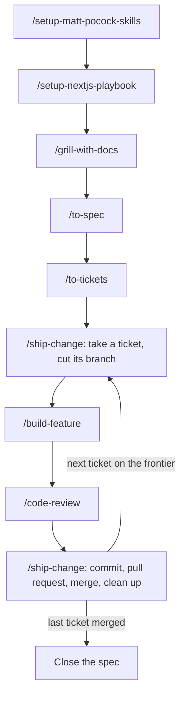

# Workflow

How the Next.js playbook works alongside
[Matt Pocock's engineering skills](https://github.com/mattpocock/skills), from
an empty repository to a merged feature. Matt's skills turn an idea into a
spec and tickets; the playbook sets up the repository, writes each ticket's
code by its rules, and ships it.



## The skills

| Skill | From | Runs | Does |
| --- | --- | --- | --- |
| `setup-matt-pocock-skills` | mattpocock/skills | Once | Records the issue tracker, triage labels and domain doc layout in `docs/agents/` |
| `setup-nextjs-playbook` | this repository | Once | Sets up the architecture, code standards, contribution flow, hooks, CI and documents |
| `grill-with-docs` | mattpocock/skills | Per piece of work | Interviews you until the design is settled, writing terms into `CONTEXT.md` and decisions into ADRs as they land |
| `to-spec` | mattpocock/skills | Per piece of work | Publishes the settled design as a spec issue |
| `to-tickets` | mattpocock/skills | Per piece of work | Breaks the spec into tickets, each a vertical slice with its blocking tickets |
| `build-feature` | this repository | Per ticket | Writes the ticket's code by the repository's code standards |
| `code-review` | mattpocock/skills | Per ticket | Reviews the branch against the code standards and against the ticket |
| `ship-change` | this repository | Per ticket | Takes the ticket from branch to merged, and cleans up |

`grill-with-docs` calls `grilling` and `domain-modeling`, so those two are
installed with it. `setup-matt-pocock-skills`, `grill-with-docs`, `to-spec` and
`to-tickets` start only when you type them; the rest, the playbook's included,
can also be picked up by the agent on its own.

Install everything once, in the repository:

```bash
npx skills add mattpocock/skills --skill setup-matt-pocock-skills grill-with-docs grilling domain-modeling to-spec to-tickets code-review
```

```bash
npx skills add davidaragundy/skills
```

Optionally, Vercel's `next-dev-loop`, which `build-feature` uses to check a
change in the running app. It needs Next.js 16.3+ with Turbopack and
`agent-browser`:

```bash
npx skills add vercel/next.js --skill next-dev-loop
```

## An example

A shop built with the playbook wants customers to cancel an order before it
ships. The branch prefix is `shp`, and the feature list holds `orders`,
`catalog` and `auth`.

### Once per repository

1. **`/setup-matt-pocock-skills`.** Answer its questions: the issues live in
   GitHub Issues, and the domain docs are a single context. It asks about
   triage labels only when Matt's `triage` skill is installed; without it, the
   labels keep their default names, such as `ready-for-agent`.
2. **`/setup-nextjs-playbook`.** It checks step 1 ran, asks for the branch
   prefix and a paragraph on the shop, and confirms the glossary and feature
   list with you. It then sets the repository up through its own issue and pull
   request, and creates the labels the issue forms, `to-spec` and `to-tickets` apply.

### Per piece of work

3. **`/grill-with-docs`** — "Customers should be able to cancel an order before
   it ships." It asks in rounds, each question with a recommended answer: is a
   partly shipped order cancellable, what happens to the payment, who else can
   cancel. As answers settle, it writes new terms such as **Cancellation** and
   **Shipment** into `CONTEXT.md`, and records an ADR when a decision is hard to
   reverse. Those edits stay uncommitted on `main` for now.
4. **`/to-spec`** — publishes the spec as issue #40, "Order cancellation", with
   user stories, implementation decisions and what is out of scope, and labels
   it `ready-for-agent`. The playbook installs no test runner, so where the spec
   asks how the work is tested, the answer is how each story is checked in the
   running app.
5. **`/to-tickets #40`** — proposes the slices and asks you to adjust them, then
   publishes them:
   - #41 "Cancel an unshipped order from its details page", blocked by nothing.
   - #42 "Refuse cancellation once the shipment is dispatched", blocked by #41.
   - #43 "Show cancelled orders in the order history", blocked by #41.

### Per ticket

6. **`/ship-change #41`** — reads the flow from `CONTRIBUTING.md` and the hooks,
   and takes #41 as the issue as published. It cuts `feat/shp-41` from `main`,
   carries grilling's edits over, and commits them as
   `docs(orders): define cancellation and shipment`.
7. **`/build-feature`** — reads #41, spec #40, the code standards, the glossary
   and the ADRs, then places each file by rule:
   - `src/app/orders/[orderId]/page.tsx` composes the page (CS-2).
   - `src/features/orders/actions/cancel-order.ts`, marked `"use server"`,
     validates its input with `src/features/orders/schemas/cancel-order.ts`,
     checks the signed-in customer owns the order, and returns only the new
     status (CS-11).
   - It reads the customer from `auth`, after checking `auth` does not import
     `orders` (CS-4).
   - `src/features/orders/components/cancel-order-button.tsx` is the smallest
     client component, with its pending state in
     `src/features/orders/hooks/use-cancel-order-button.ts` (CS-17).

   It runs lint and typecheck, checks the change in the running app, and
   reviews its own diff against the rules.
8. **`/code-review main`** — two reviews side by side: the diff against
   `docs/code-standards.md`, and against #41's acceptance criteria. Fixes go on
   the branch.
9. **`/ship-change`** — commits one concern at a time, runs the checks, and shows
   you the pull request before opening it:
   `feat(orders): let customers cancel an unshipped order`, with `Closes #41`.
   Once CI is green you merge it. It then checks the merged head against the
   branch tip, confirms #41 closed, and deletes the branch.
10. **Next ticket.** #42 and #43 are now unblocked; each gets its own
    `/ship-change`, branch and pull request. For #42, `build-feature` finds that
    **Shipment** has its own lifecycle and no feature owns it, and stops to
    propose a `shipments` feature. Once you agree, it adds it to the feature
    list in `docs/code-standards.md` and the scopes in `CONTRIBUTING.md` on that
    branch.

### Closing the spec

After #43 merges, `ship-change` finds every ticket under #40 closed and tells
you. Close #40 by hand: `to-tickets` never closes a spec, and no pull request
does.

## Where the two meet

| Meeting point | How it works |
| --- | --- |
| Specs and tickets | They are issues. `ship-change` keeps their templates and titles instead of rewriting them into the issue forms, and `CONTRIBUTING.md` says so. |
| `/implement` | `build-feature` takes its place. `/implement` builds test-first with `/tdd` and runs a test suite, which the playbook does not install. |
| Tests | Adding a test runner is your decision; `build-feature` stops and asks when a ticket wants tests. Once one exists, `/tdd` works at the seams the spec agreed. |
| `CONTEXT.md` and ADRs | Both sets of skills use the same formats. Grilling writes them; `build-feature` reads them, and stops for you on a term they lack. |
| Grilling's edits | They ship on the first ticket's branch, as their own `docs` commit. |
| Labels | `setup-nextjs-playbook` creates `ready-for-agent` and the forms' labels, under the names `docs/agents/triage-labels.md` maps them to. |

A bug or a small change does not need a spec: `/ship-change` opens an issue
from the matching form, and the rest of the per-ticket steps apply.
