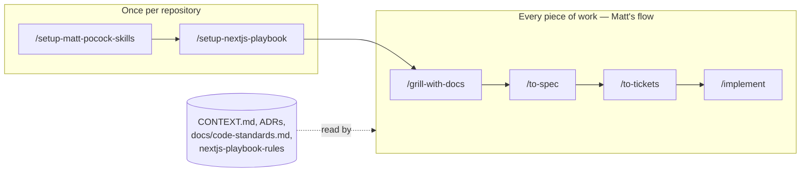

# Workflow

The Next.js playbook has no workflow of its own. The work follows
[Matt Pocock's engineering skills](https://github.com/mattpocock/skills), as he
designed them. The playbook supplies what those skills read along the way: the
repository's structure, its code standards, its glossary and decisions, and the
hooks that check every commit.



## Install

In the repository:

```bash
npx skills add mattpocock/skills --skill setup-matt-pocock-skills grill-with-docs grilling domain-modeling to-spec to-tickets implement tdd code-review
```

```bash
npx skills add davidaragundy/skills
```

`grill-with-docs` calls `grilling` and `domain-modeling`, and `implement` calls
`tdd` and `code-review`, so those are installed with them.

## Once per repository

1. **`/setup-matt-pocock-skills`** — records where issues live and the domain doc
   layout in `docs/agents/`.
2. **`/setup-nextjs-playbook`** — writes the playbook into the repository: the
   feature-based structure, `docs/code-standards.md`, `CONTEXT.md`, the first
   ADR, `CONTRIBUTING.md`, the hooks and CI.

## Every piece of work

Matt's flow, unchanged. What each step reads from the playbook:

| Step | What it does | What it reads from the playbook |
| --- | --- | --- |
| `/grill-with-docs` | Interviews you until the design is settled, writing terms and decisions down as they land | `CONTEXT.md` and `docs/adr/`, which it extends in the same formats |
| `/to-spec` | Publishes the settled design as a spec | The glossary's terms and the ADRs in the area |
| `/to-tickets` | Breaks the spec into tickets, each a vertical slice | The glossary's terms and the ADRs in the area |
| `/implement` | Builds a ticket, test-first with `/tdd`, and reviews it with `/code-review` | `nextjs-playbook-rules` for where each file goes and how it is written; `/code-review` checks the diff against `docs/code-standards.md`, which `CONTRIBUTING.md` links |

Around it, the repository's own rules apply as they would to any change:
`CONTRIBUTING.md` names the branch a ticket is built on, and the hooks check
every commit `/implement` makes and every push.

## An example

A shop wants customers to cancel an order before it ships.

- **`/grill-with-docs`** settles what "ships" means and whether a partly shipped
  order can be cancelled, and adds **Cancellation** and **Shipment** to
  `CONTEXT.md`.
- **`/to-spec`** and **`/to-tickets`** turn that into a spec and tickets, the first
  being "Cancel an unshipped order from its details page".
- **`/implement`** builds that ticket. Placing its files, it follows
  `nextjs-playbook-rules`:
  - The page at `src/app/orders/[orderId]/page.tsx` only composes (CS-2).
  - The cancellation is a server action in
    `src/features/orders/actions/cancel-order.ts`: it validates its input with
    `src/features/orders/schemas/cancel-order.ts`, checks the customer owns the
    order, and returns only the new status (CS-11).
  - The button is the smallest client component,
    `src/features/orders/components/cancel-order-button.tsx`, with its pending
    state in `src/features/orders/hooks/use-cancel-order-button.ts` (CS-17).

  `/code-review` then reads the diff against `docs/code-standards.md` and against
  the ticket.

## Things to know

- **Tests.** The playbook installs no test runner, and `/tdd` needs one. Until
  the project adds a runner, `/implement` has no tests to write or run.
- **Labels.** `/to-spec` and `/to-tickets` apply the `ready-for-agent` label, and
  `gh` refuses a label the repository does not have. Create it once:
  `gh label create ready-for-agent`.
- **A new feature.** When a ticket touches a domain concept no feature owns,
  `nextjs-playbook-rules` has the agent propose a new feature to you instead of
  choosing one. Once you agree, it joins the feature list in
  `docs/code-standards.md` and the scopes in `CONTRIBUTING.md`.
